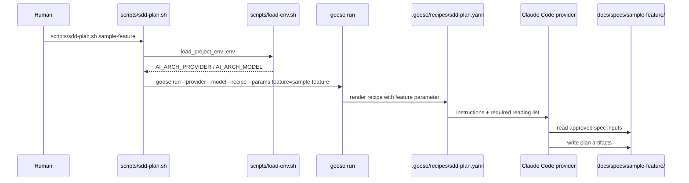
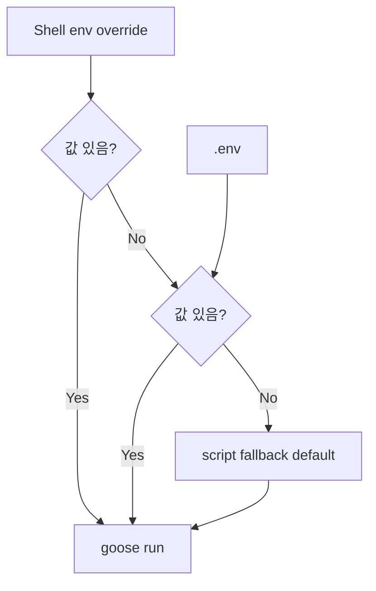
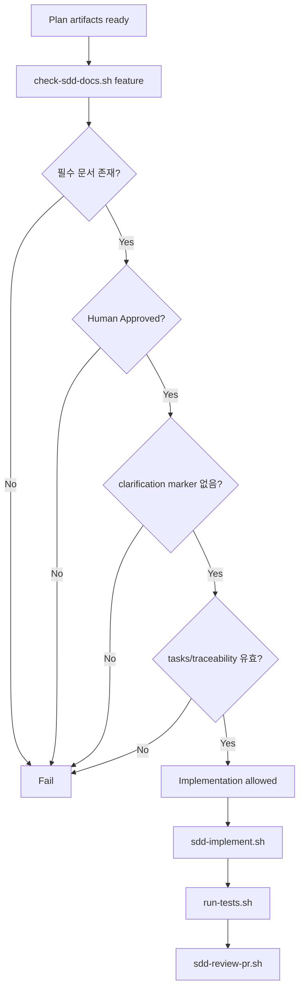
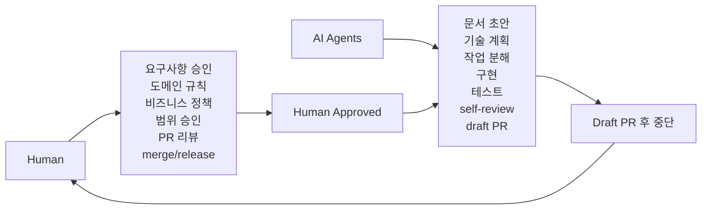
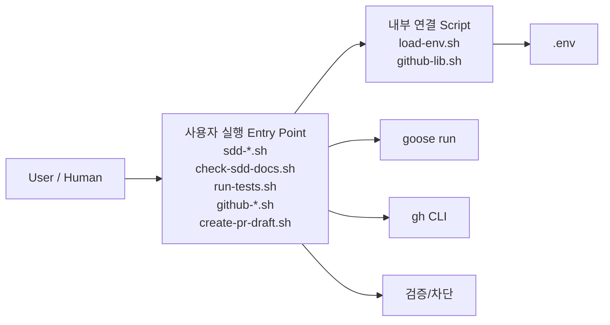
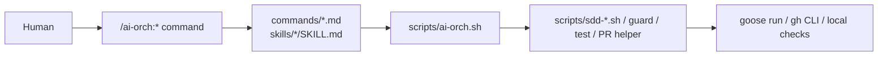
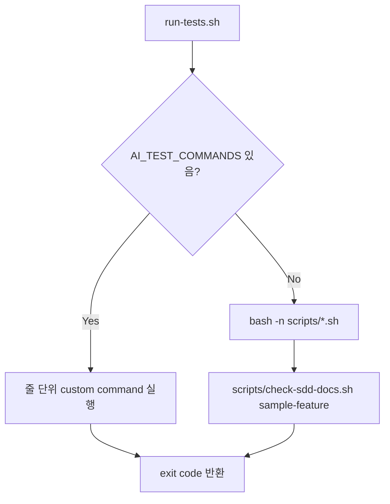
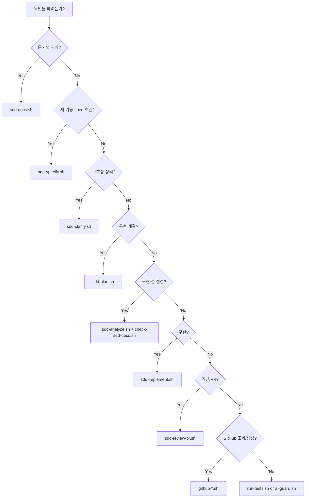

# AI Orchestration Flow

작성일: 2026-05-12  
목적: `ai-orch`를 사용할 때 입력 command가 어떤 계층을 거쳐 어떤 산출물을 만드는지 한눈에 설명한다.

## 1. 한눈에 보는 실행 구조

```mermaid
flowchart LR
    U[User / Human] --> NATIVE["Native Command<br/>/ai-orch:plan feature"]
    U --> CMD["Shell Command<br/>scripts/ai-orch.sh plan feature<br/>scripts/sdd-plan.sh feature"]
    NATIVE --> CMD
    CMD --> ENV["scripts/load-env.sh<br/>.env 로딩"]
    ENV --> VAR["Provider/Model 선택<br/>AI_DOC_* / AI_ARCH_* / AI_CODE_* / AI_REVIEW_*"]
    VAR --> GOOSE["goose run<br/>--provider<br/>--model<br/>--recipe<br/>--params feature=..."]
    GOOSE --> RECIPE[".goose/recipes/*.yaml<br/>단계별 instruction"]
    RECIPE --> POLICY["Policy Context<br/>AGENTS.md<br/>constitution.md<br/>ai-governance.md<br/>project-settings.md"]
    RECIPE --> SPECIN["Input Specs<br/>docs/specs/{feature}/..."]
    POLICY --> AGENT["AI Provider<br/>Codex / Claude Code"]
    SPECIN --> AGENT
    AGENT --> OUTPUT["Output Artifacts<br/>docs/specs/{feature}/...<br/>code/tests/self-review/PR draft"]
    OUTPUT --> GATE["Gate / Verification<br/>check-sdd-docs.sh<br/>run-tests.sh"]
    GATE --> HUMAN["Human Review<br/>scope/PR/merge/release 결정"]
```



핵심은 native command가 command hinting UX를 제공하고, `scripts/ai-orch.sh`와 `scripts/sdd-*.sh`가 안정적인 실행 진입점을 맡는 구조다. `goose`가 실행 엔진이며, `.goose/recipes/`가 단계별 행동 규칙이다. 산출물은 대부분 `docs/specs/{feature}/`에 쌓이고, 구현 단계 이후에만 source code와 tests가 변경된다.

## 2. Command에서 Goose까지

예: planning 단계 실행

```bash
scripts/sdd-plan.sh sample-feature
```

실제 내부 흐름:



`scripts/sdd-plan.sh`는 직접 planning을 하지 않는다. 이 script는 `.env`를 읽고 `goose run`을 정확한 provider/model/recipe/parameter로 호출하는 thin wrapper다.

## 3. SDD 단계별 입출력

| 단계 | 사용자 명령 | 기본 provider | 주요 입력 | 주요 산출물 |
|---|---|---|---|---|
| 문서/리서치 | `scripts/sdd-docs.sh "topic" docs/output.md` | Codex | topic | 지정한 Markdown 문서 |
| Specify | `scripts/sdd-specify.sh {feature} "설명"` | Codex | 기능 설명, governance docs | `spec.md`, `requirements.md`, `acceptance-criteria.md`, `clarifications.md` |
| Clarify | `scripts/sdd-clarify.sh {feature}` | Codex | spec, requirements, acceptance criteria | `clarifications.md`, human decision point |
| Plan | `scripts/sdd-plan.sh {feature}` | Claude Code | approved requirements, acceptance criteria, clarifications | `technical-plan.md`, `plan.md`, `research.md`, `data-model.md`, `contracts/`, `quickstart.md`, `tasks.md`, `test-plan.md`, `traceability.md` |
| Analyze | `scripts/sdd-analyze.sh {feature}` | Claude Code | spec docs, plan docs, tasks, tests, traceability | `analysis.md`, `checklist.md` |
| Gate | `scripts/check-sdd-docs.sh {feature}` | local script | feature docs | pass/fail |
| Implement | `scripts/sdd-implement.sh {feature}` | Claude Code | all approved SDD docs, tasks | source code, tests, test notes |
| Test | `scripts/run-tests.sh` | local script | repository test commands | pass/fail |
| Review/PR | `scripts/sdd-review-pr.sh {feature}` | Claude Code | changed files, SDD docs, test results | `self-review.md`, PR description/draft PR |

## 4. Feature 산출물 위치

모든 기능별 durable state는 `docs/specs/{feature}/` 아래에 둔다.

```text
docs/specs/{feature}/
├── spec.md
├── requirements.md
├── acceptance-criteria.md
├── clarifications.md
├── technical-plan.md
├── plan.md
├── research.md
├── data-model.md
├── contracts/
├── quickstart.md
├── tasks.md
├── test-plan.md
├── traceability.md
├── analysis.md
├── checklist.md
└── self-review.md
```

이 구조에서 `requirements.md`와 `acceptance-criteria.md`는 사람이 `Human Approved` 상태로 승인해야 구현이 가능하다.

## 5. Provider 선택 흐름



기본 역할 분담:

| 작업 유형 | 변수 | 기본값 |
|---|---|---|
| 문서/리서치 | `AI_DOC_PROVIDER`, `AI_DOC_MODEL` | `codex-acp`, `gpt-5.5` |
| 아키텍처/계획 | `AI_ARCH_PROVIDER`, `AI_ARCH_MODEL` | `claude-code`, `default` |
| 구현/테스트 | `AI_CODE_PROVIDER`, `AI_CODE_MODEL` | `claude-code`, `default` |
| 리뷰/PR draft | `AI_REVIEW_PROVIDER`, `AI_REVIEW_MODEL` | `claude-code`, `default` |

일회성 override:

```bash
AI_CODE_PROVIDER=codex-acp AI_CODE_MODEL=gpt-5.5 scripts/sdd-implement.sh sample-feature
```

## 6. Guard 흐름



`check-sdd-docs.sh`는 AI가 구현을 시작하기 전에 반드시 통과해야 하는 hard gate다. 실패하면 AI는 구현하지 않고 누락된 문서나 승인 상태를 먼저 해결해야 한다.

## 7. 사람과 AI의 책임 경계



AI가 멈춰야 하는 경우:

- business rule이 없음
- domain behavior가 모호함
- requirement가 기존 동작과 충돌함
- security/authorization policy가 불명확함
- payment/pricing/user permission/customer-facing policy에 영향이 있음
- draft PR이 생성됨

## 8. 실제 사용 예

Claude Code나 Codex에서 사용할 때는 고수준 command wrapper인 `scripts/ai-orch.sh`를 우선 사용한다. 이 wrapper는 실행할 flow의 계획을 먼저 출력하고, 기존 entrypoint script를 순서대로 호출한다.

```bash
scripts/ai-orch.sh feature new-feature "새 기능 설명"
# Human edits and approves requirements.md / acceptance-criteria.md
scripts/ai-orch.sh plan new-feature
scripts/ai-orch.sh ready new-feature
scripts/ai-orch.sh implement new-feature
scripts/ai-orch.sh review new-feature
```

실행하지 않고 flow 계획만 확인:

```bash
scripts/ai-orch.sh explain implement new-feature
```

Claude Code/Codex native command plugin을 활성화했다면 같은 flow를 command hinting으로 선택할 수 있다.

```text
/ai-orch:help
/ai-orch:docs <topic> <output-markdown-path>
/ai-orch:feature new-feature "새 기능 설명"
/ai-orch:plan new-feature
/ai-orch:ready new-feature
/ai-orch:implement new-feature
/ai-orch:review new-feature
/ai-orch:pr new-feature
```

native command는 SDD 로직을 직접 갖지 않는다. 각 command는 `scripts/ai-orch.sh <flow>`를 호출하고, 실제 guard, Goose recipe, GitHub helper는 기존 shell wrapper가 담당한다.

새 기능을 시작하는 일반 흐름:

```bash
scripts/sdd-specify.sh new-feature "새 기능 설명"
# Human edits and approves requirements.md / acceptance-criteria.md
scripts/sdd-clarify.sh new-feature
scripts/sdd-plan.sh new-feature
# Human reviews plan and scope
scripts/sdd-analyze.sh new-feature
scripts/check-sdd-docs.sh new-feature
scripts/sdd-implement.sh new-feature
scripts/run-tests.sh
scripts/sdd-review-pr.sh new-feature
```

Recipe를 직접 확인해야 할 때:

```bash
goose run \
  --recipe .goose/recipes/sdd-plan.yaml \
  --params feature=sample-feature \
  --render-recipe
```

## 9. Script별 동작

### 9.1 사용자 실행 Script와 내부 연결 Script 구분

`scripts/` 아래 파일은 모두 같은 성격이 아니다. 운영자가 직접 실행하는 entrypoint와, 다른 script가 `source`하거나 내부에서 호출하는 helper를 구분해서 봐야 한다.



#### 사용자가 직접 실행하는 script

| 분류 | Script | 사용자가 실행하는 상황 |
|---|---|---|
| 통합 command | `scripts/ai-orch.sh` | Claude Code/Codex 또는 사용자가 flow 단위 command를 실행할 때 |
| SDD 단계 실행 | `scripts/sdd-docs.sh` | 문서/리서치 산출물을 만들 때 |
| SDD 단계 실행 | `scripts/sdd-specify.sh` | feature spec 초안을 만들 때 |
| SDD 단계 실행 | `scripts/sdd-clarify.sh` | 요구사항 모호성을 정리할 때 |
| SDD 단계 실행 | `scripts/sdd-plan.sh` | 기술 계획과 작업 분해를 만들 때 |
| SDD 단계 실행 | `scripts/sdd-analyze.sh` | 구현 전 문서 일관성을 점검할 때 |
| SDD 단계 실행 | `scripts/sdd-implement.sh` | 승인된 task를 구현할 때 |
| SDD 단계 실행 | `scripts/sdd-review-pr.sh` | self-review와 PR draft를 준비할 때 |
| Gate/Test | `scripts/check-sdd-docs.sh` | 구현 전 SDD 문서 gate를 직접 확인할 때 |
| Gate/Test | `scripts/run-tests.sh` | shell syntax, sample gate, 프로젝트 테스트를 실행할 때 |
| Safety | `scripts/ai-guard.sh` | 위험 명령을 한 번 감싸서 실행할 때 |
| GitHub | `scripts/github-check.sh` | GitHub CLI 연결 상태를 확인할 때 |
| GitHub | `scripts/github-issue-list.sh` | issue 목록을 볼 때 |
| GitHub | `scripts/github-issue-view.sh` | issue 상세를 볼 때 |
| GitHub | `scripts/github-issue-create.sh` | issue를 만들 때 |
| GitHub | `scripts/github-pr-list.sh` | PR 목록을 볼 때 |
| GitHub | `scripts/github-pr-view.sh` | PR 상세를 볼 때 |
| GitHub | `scripts/github-pr-check.sh` | PR check 상태를 볼 때 |
| GitHub | `scripts/create-pr-draft.sh` | SDD 문서 링크가 포함된 draft PR을 직접 만들 때 |
| Bootstrap | `scripts/bootstrap-ai-orch.sh` | 새 repository skeleton을 초기화할 때만 |

#### 사용자가 보통 직접 실행하지 않는 내부 연결 script

| Script | 호출 방식 | 연결되는 script | 역할 |
|---|---|---|---|
| `scripts/load-env.sh` | `source` | `sdd-*.sh`, `github-lib.sh` | `.env`를 읽어 환경 변수를 export |
| `scripts/github-lib.sh` | `source` | `github-*.sh`, `create-pr-draft.sh` | `gh` 설치/인증 확인, repository 해석 |

#### 내부에서 다른 script를 호출하는 경우

| 사용자 실행 script | 내부 연결 | 의미 |
|---|---|---|
| `scripts/ai-orch.sh` | flow별로 `sdd-*.sh`, `check-sdd-docs.sh`, `run-tests.sh`, `create-pr-draft.sh` 호출 | 사용자용 command를 flow 단위로 묶고 실행 계획을 출력 |
| `scripts/run-tests.sh` | `scripts/check-sdd-docs.sh sample-feature` | 기본 테스트에 sample SDD gate를 포함 |
| `scripts/create-pr-draft.sh` | `scripts/github-lib.sh` → `scripts/load-env.sh` | GitHub repo와 인증을 확인한 뒤 draft PR 생성 |
| `scripts/github-*.sh` | `scripts/github-lib.sh` → `scripts/load-env.sh` | 공통 GitHub 설정과 인증을 재사용 |
| `scripts/sdd-*.sh` | `scripts/load-env.sh` → `goose run` | `.env` 기반 provider/model로 Goose recipe 실행 |
| `scripts/sdd-implement.sh` | `goose recipe`가 `scripts/check-sdd-docs.sh {feature}` 실행을 지시 | 구현 전 gate를 AI 실행 절차에 포함 |

### 9.2 SDD Goose Wrapper Scripts

이 그룹은 모두 같은 구조를 따른다.

```text
입력 인자 확인
→ scripts/load-env.sh 로 .env 로딩
→ provider/model 선택
→ goose run --recipe ...
→ docs/specs/{feature}/ 산출물 생성 또는 갱신
```

| Script | 입력 | Provider/Model 변수 | Goose recipe | 주요 산출물/효과 |
|---|---|---|---|---|
| `scripts/sdd-docs.sh` | `<topic> <output-markdown-path>` | `AI_DOC_PROVIDER`, `AI_DOC_MODEL` | `.goose/recipes/sdd-research-docs.yaml` | 지정한 Markdown 문서 작성 |
| `scripts/sdd-specify.sh` | `<feature-name> [feature-description]` | `AI_DOC_PROVIDER`, `AI_DOC_MODEL` | `.goose/recipes/sdd-specify.yaml` | `spec.md`, `requirements.md`, `acceptance-criteria.md`, `clarifications.md` 초안 |
| `scripts/sdd-clarify.sh` | `<feature-name>` | `AI_DOC_PROVIDER`, `AI_DOC_MODEL` | `.goose/recipes/sdd-clarify.yaml` | `clarifications.md` 갱신, human decision point 정리 |
| `scripts/sdd-plan.sh` | `<feature-name>` | `AI_ARCH_PROVIDER`, `AI_ARCH_MODEL` | `.goose/recipes/sdd-plan.yaml` | `technical-plan.md`, `plan.md`, `tasks.md`, `test-plan.md`, `traceability.md` 등 계획 산출물 |
| `scripts/sdd-analyze.sh` | `<feature-name>` | `AI_REVIEW_PROVIDER`, `AI_REVIEW_MODEL` | `.goose/recipes/sdd-analyze.yaml` | `analysis.md`, `checklist.md` |
| `scripts/sdd-implement.sh` | `<feature-name>` | `AI_CODE_PROVIDER`, `AI_CODE_MODEL` | `.goose/recipes/sdd-implement.yaml` | 승인된 `tasks.md` 범위의 code/test 변경 |
| `scripts/sdd-review-pr.sh` | `<feature-name>` | `AI_REVIEW_PROVIDER`, `AI_REVIEW_MODEL` | `.goose/recipes/sdd-review-pr.yaml` | `self-review.md`, PR description 또는 draft PR |

예를 들어 `scripts/sdd-plan.sh sample-feature`는 다음 명령으로 귀결된다.

```bash
goose run \
  --provider "$AI_ARCH_PROVIDER" \
  --model "$AI_ARCH_MODEL" \
  --recipe .goose/recipes/sdd-plan.yaml \
  --params "feature=sample-feature"
```

### 9.3 Native Command Plugin

`plugins/ai-orch/`는 Claude Code와 Codex에서 command hinting을 제공하기 위한 repo-local plugin이다. Claude Code는 `commands/`를 사용하고, Codex는 `skills/`를 사용해 같은 `/ai-orch:*` UX를 노출한다.



Marketplace/manifest:

| 대상 | Manifest | 역할 |
|---|---|---|
| Claude Code | `.claude-plugin/marketplace.json` | repo-local marketplace 등록 |
| Claude Code | `plugins/ai-orch/.claude-plugin/plugin.json` | plugin metadata |
| Codex | `.agents/plugins/marketplace.json` | repo-local marketplace 등록 |
| Codex | `plugins/ai-orch/.codex-plugin/plugin.json` | plugin metadata와 UI metadata |
| Codex | `plugins/ai-orch/skills/*/SKILL.md` | command hinting용 skill surface |

1차 command set:

| Native command | 위임되는 shell flow | 목적 |
|---|---|---|
| `/ai-orch:help` | `scripts/ai-orch.sh help` | 사용 가능한 flow와 예시 출력 |
| `/ai-orch:docs <topic> <output>` | `scripts/ai-orch.sh docs <topic> <output>` | 문서/리서치 작성 |
| `/ai-orch:feature <feature> [description]` | `scripts/ai-orch.sh feature <feature> [description]` | 새 feature SDD 초안 작성 |
| `/ai-orch:plan <feature>` | `scripts/ai-orch.sh plan <feature>` | 기술 계획과 task/test plan 작성 |
| `/ai-orch:ready <feature>` | `scripts/ai-orch.sh ready <feature>` | readiness analysis와 implementation gate 실행 |
| `/ai-orch:implement <feature>` | `scripts/ai-orch.sh implement <feature>` | gate 통과 후 구현과 테스트 실행 |
| `/ai-orch:review <feature>` | `scripts/ai-orch.sh review <feature>` | 테스트, self-review, PR 준비 |
| `/ai-orch:pr <feature>` | `scripts/ai-orch.sh pr <feature>` | 기존 SDD/self-review 기반 draft PR 생성 |

설치 예:

```bash
claude plugin marketplace add shaul1991/ai-orch
claude plugin install -s project ai-orch@ai-orch
codex plugin marketplace add shaul1991/ai-orch
```

Codex는 plugin skill을 통해 command hinting을 제공한다. 설치 후 plugin 상세에 `Skills`가 표시되어야 한다.

Claude Code prompt 안에서는 다음 slash command로도 설치할 수 있다.

```text
/plugin marketplace add shaul1991/ai-orch
/plugin install ai-orch@ai-orch
```

### 9.4 통합 Flow Command: `scripts/ai-orch.sh`

`scripts/ai-orch.sh`는 Claude Code나 Codex에서 사용하기 쉬운 command형 wrapper다. 사용자는 개별 script를 외우지 않고 flow 이름을 선택한다.

공통 동작:

```text
flow 이름 확인
→ 실행 계획 출력
→ flow에 연결된 기존 script들을 순서대로 실행
→ 각 script가 필요하면 .env를 읽고 goose/gh/local 검증을 수행
```

| Flow command | 내부에서 실행하는 script | 목적 |
|---|---|---|
| `scripts/ai-orch.sh help` | 없음 | 사용 가능한 flow 출력 |
| `scripts/ai-orch.sh doctor` | `scripts/run-tests.sh` | 로컬 script syntax와 sample SDD gate 확인 |
| `scripts/ai-orch.sh docs <topic> <output>` | `scripts/sdd-docs.sh` | 문서/리서치 작성 |
| `scripts/ai-orch.sh feature <feature> [description]` | `scripts/sdd-specify.sh` | 새 feature 시작. 사람 승인 전까지만 진행 |
| `scripts/ai-orch.sh specify <feature> [description]` | `scripts/sdd-specify.sh` | specify 단계 실행 |
| `scripts/ai-orch.sh clarify <feature>` | `scripts/sdd-clarify.sh` | clarification 단계 실행 |
| `scripts/ai-orch.sh plan <feature>` | `scripts/sdd-plan.sh` | planning 산출물 작성 |
| `scripts/ai-orch.sh ready <feature>` | `scripts/sdd-analyze.sh`, `scripts/check-sdd-docs.sh` | 구현 가능 상태 점검 |
| `scripts/ai-orch.sh implement <feature>` | `scripts/check-sdd-docs.sh`, `scripts/sdd-implement.sh`, `scripts/run-tests.sh` | gate 통과 후 구현과 테스트 |
| `scripts/ai-orch.sh review <feature>` | `scripts/run-tests.sh`, `scripts/sdd-review-pr.sh` | self-review와 PR 준비 |
| `scripts/ai-orch.sh pr <feature>` | `scripts/create-pr-draft.sh` | 기존 self-review 기반 draft PR 생성 |
| `scripts/ai-orch.sh release-check <feature>` | `scripts/sdd-analyze.sh`, `scripts/check-sdd-docs.sh`, `scripts/run-tests.sh`, `scripts/sdd-review-pr.sh` | merge/release 전 검증. merge/release는 하지 않음 |
| `scripts/ai-orch.sh explain <flow>` | 없음 | flow 실행 계획만 출력 |

예:

```bash
scripts/ai-orch.sh explain implement login
scripts/ai-orch.sh implement login
```

### 9.5 `scripts/load-env.sh`

모든 주요 wrapper가 공유하는 환경 로더다.

동작:

1. `.env`가 없으면 조용히 통과한다.
2. 빈 줄과 주석을 무시한다.
3. `KEY=value` 또는 `export KEY=value` 형식을 읽는다.
4. key가 shell variable 이름으로 유효할 때만 export한다.
5. 이미 shell에 같은 key가 있으면 덮어쓰지 않는다.

따라서 shell에서 직접 넘긴 값이 `.env`보다 우선한다.

```bash
AI_CODE_PROVIDER=codex-acp scripts/sdd-implement.sh sample-feature
```

### 9.6 Guard and Test Scripts

| Script | 입력 | 내부 동작 | 결과 |
|---|---|---|---|
| `scripts/check-sdd-docs.sh` | `<feature-name>` | 필수 SDD 문서, `Human Approved`, clarification marker, task ID, traceability를 검사 | 성공 시 `[SDD_GATE_PASSED]`, 실패 시 `[SDD_GATE_FAILED]` |
| `scripts/run-tests.sh` | 없음 | `AI_TEST_COMMANDS`가 있으면 줄 단위로 실행, 없으면 `bash -n scripts/*.sh`와 sample gate 실행 | test pass/fail |
| `scripts/ai-guard.sh` | `<command...>` | 금지 command pattern 검사 후 안전하면 `exec "$@"` | 금지 명령이면 `[AI_GUARD_BLOCKED]` |

`check-sdd-docs.sh`가 보는 최소 조건:

```text
.specify/memory/constitution.md
docs/specs/{feature}/spec.md
docs/specs/{feature}/requirements.md          # Human Approved 필요
docs/specs/{feature}/acceptance-criteria.md   # Human Approved 필요
docs/specs/{feature}/tasks.md                 # T001 형태 필요
docs/specs/{feature}/traceability.md          # FR-001, T001 연결 필요
```

`run-tests.sh`의 기본 flow:



### 9.7 GitHub Helper Scripts

GitHub helper는 `scripts/github-lib.sh`를 공유한다.

공통 동작:

1. `.env` 로딩
2. `gh` 설치 여부 확인
3. `gh auth token`으로 인증 확인
4. `AI_GITHUB_ACCOUNT`가 있으면 active `gh` account와 일치하는지 확인
5. `AI_GITHUB_REPO`가 있으면 그 값을 사용
6. 없으면 `gh repo view`로 현재 repository 추론

여러 GitHub 계정을 쓰는 경우 `.env`에 다음 값을 둔다.

```bash
AI_GITHUB_ACCOUNT=shaul1991
AI_GITHUB_REPO=shaul1991/ai-orch
```

회사 repository라면 회사 계정 login과 대상 repo를 명시한다.

```bash
AI_GITHUB_ACCOUNT=atms-jihoon
AI_GITHUB_REPO=atms-backend/example-repo
```

`AI_GITHUB_REPO`는 origin remote가 없을 때뿐 아니라 helper script의 대상 repo를 명시적으로 고정하고 싶을 때도 설정할 수 있다. active account가 다르면 wrapper는 실행을 멈추고 `gh auth switch --user <expected-account>`를 안내한다. GitHub access token은 local `.env`에 넣지 않고 `gh auth login`이 관리하는 OS keychain을 사용한다.

| Script | 입력 | 실행하는 GitHub 작업 |
|---|---|---|
| `scripts/github-check.sh` | 없음 | `gh` 버전, 인증 사용자, repository 확인 |
| `scripts/github-issue-list.sh` | `[state]` | issue 목록 조회. 기본 `open` |
| `scripts/github-issue-view.sh` | `<issue-number>` | issue 상세와 comments 조회 |
| `scripts/github-issue-create.sh` | `<title> [body-or-body-file] [labels]` | issue 생성 |
| `scripts/github-pr-list.sh` | `[state]` | PR 목록 조회. 기본 `open` |
| `scripts/github-pr-view.sh` | `<pr-number>` | PR 상세와 comments 조회 |
| `scripts/github-pr-check.sh` | `[pr-number]` | PR checks 조회 |
| `scripts/create-pr-draft.sh` | `<feature-name>` | SDD 문서 링크가 포함된 draft PR 생성 |

`create-pr-draft.sh`는 `docs/specs/{feature}/self-review.md`가 없으면 실패한다. draft PR 본문에는 constitution, spec, requirements, plans, tasks, tests, traceability, self-review 링크가 포함된다.

### 9.8 Bootstrap Script

`scripts/bootstrap-ai-orch.sh`는 새 repository에 기본 skeleton을 만들기 위한 script다.

동작:

- `docs/specs/sample-feature/`와 `contracts/` 생성
- `.specify/memory/`, `.goose/recipes/`, `.opencode/skills/`, `scripts/` 생성
- `.claude-plugin/`, `.agents/plugins/`, `plugins/ai-orch/commands/` 생성
- `plugins/ai-orch/skills/` 생성
- 필수 문서와 recipe, script 파일을 `touch`
- `scripts/*.sh`에 execute permission 부여

주의:

- 이 script는 파일 내용을 채우지 않는다.
- 이미 있는 파일을 삭제하거나 덮어쓰지는 않지만, 빈 파일이 많은 초기 skeleton을 만들기 위한 용도다.
- 현재 repository처럼 내용이 채워진 상태에서는 일반 사용 흐름에 포함되지 않는다.

## 10. Script 선택 기준



## 11. 요약

`ai-orch`의 flow는 다음 문장으로 정리할 수 있다.

```text
Human input
→ scripts/sdd-*.sh
→ load .env
→ goose run
→ .goose recipe
→ Codex or Claude Code
→ docs/specs/{feature}/ 산출물
→ check-sdd-docs / run-tests
→ self-review / draft PR
→ Human review
```

즉, 이 저장소는 `scripts/`를 안정적인 명령 인터페이스로 두고, `goose`를 orchestration runtime으로 사용하며, `docs/specs/{feature}/`를 기능별 상태 저장소로 사용하는 구조다.
